# Diagram Creation with Mermaid

This guide explains how to create and use diagrams in your research documents using Mermaid.js.

## Overview

Mermaid is a JavaScript-based diagramming tool that renders text-based definitions into diagrams. It's perfect for research documents because:

- **Version Control Friendly**: Diagrams are text, not binary files
- **Easy to Edit**: Simple syntax for creating complex diagrams
- **Multiple Types**: Flowcharts, sequence diagrams, Gantt charts, and more
- **Markdown Compatible**: Works directly in markdown files

## Prerequisites

### Required Tools

1. **mermaid-cli** - For rendering diagrams to images
   ```bash
   npm install -g @mermaid-js/mermaid-cli
   ```

2. **VS Code Extension** (Recommended)
   - [Mermaid Preview](https://marketplace.visualstudio.com/items?itemName=bierner.markdown-mermaid)
   - Provides live preview of diagrams in VS Code

### Verification

```bash
# Check mermaid-cli installation
mmdc --version

# Should output version number
```

## Diagram Types

### 1. Flowcharts

Perfect for process flows, decision trees, and workflows.

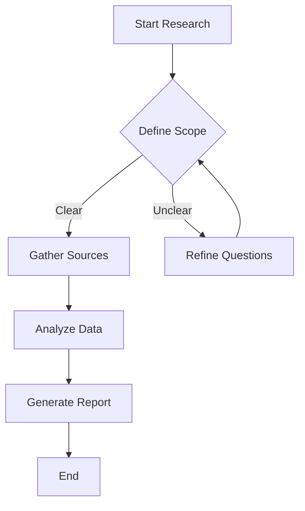

**Usage in Research:**
- Research methodology workflows
- Decision-making processes
- Data processing pipelines

### 2. Sequence Diagrams

Show interactions between components over time.

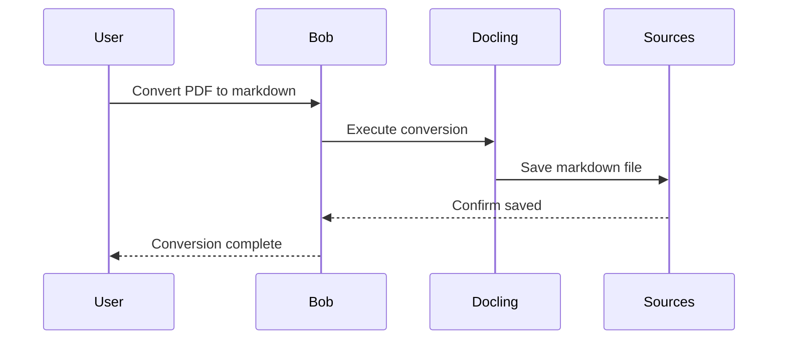

**Usage in Research:**
- System interactions
- API workflows
- Process sequences

### 3. Gantt Charts

Project timelines and schedules.

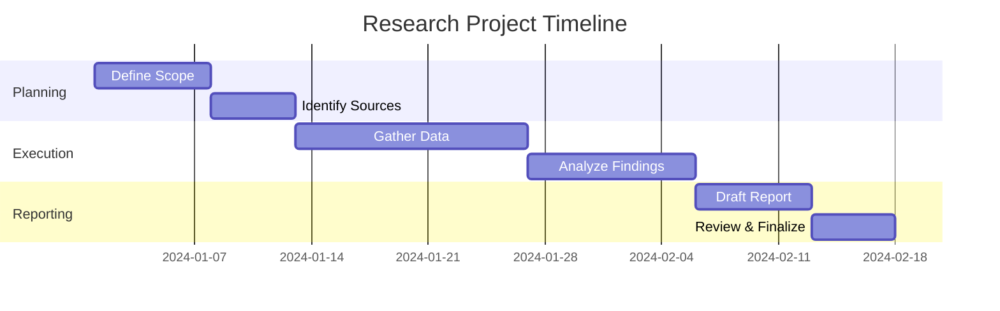

**Usage in Research:**
- Project planning
- Milestone tracking
- Resource allocation

### 4. Class Diagrams

Structure and relationships.

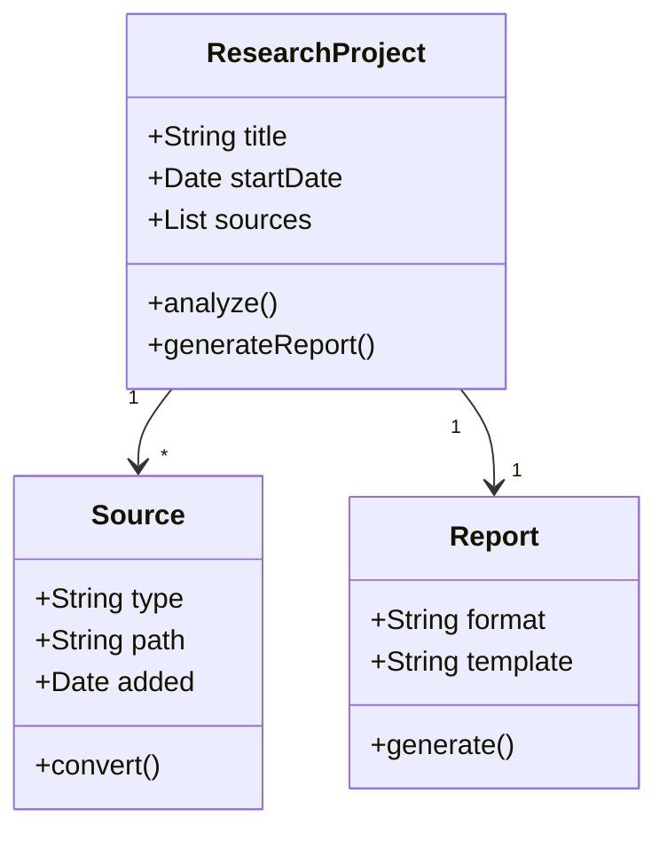

**Usage in Research:**
- Data models
- System architecture
- Conceptual frameworks

### 5. Entity Relationship Diagrams

Data relationships and structures.

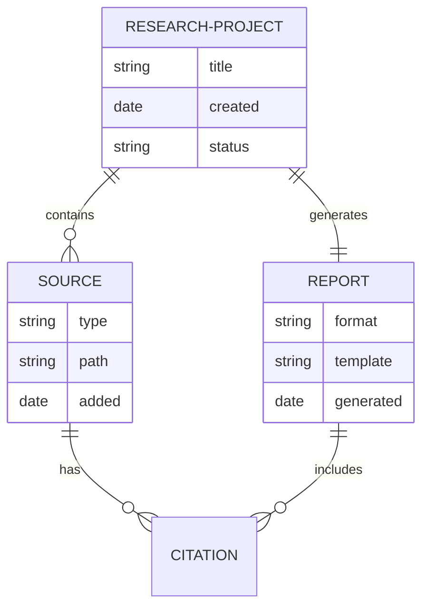

**Usage in Research:**
- Database design
- Data relationships
- Information architecture

### 6. Mind Maps

Brainstorming and concept mapping.

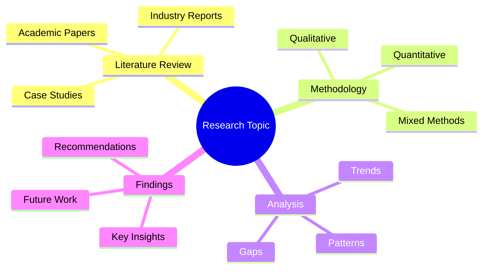

**Usage in Research:**
- Brainstorming sessions
- Concept organization
- Topic exploration

### 7. Timeline

Historical or sequential events.

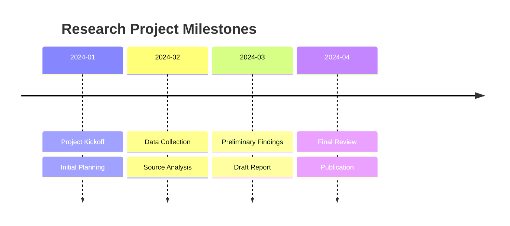

**Usage in Research:**
- Project history
- Event sequences
- Milestone tracking

## Creating Diagrams

### In Markdown Files

Simply include Mermaid code in fenced code blocks:

````markdown
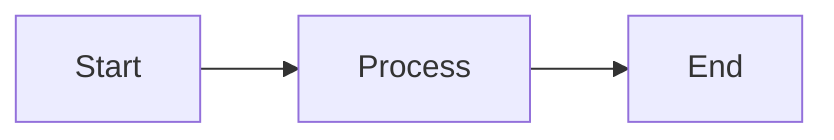
````

### Rendering to Images

Use mermaid-cli to convert diagrams to images:

```bash
# Render single diagram
mmdc -i diagram.mmd -o diagram.png

# Render with specific theme
mmdc -i diagram.mmd -o diagram.png -t dark

# Render with custom size
mmdc -i diagram.mmd -o diagram.png -w 1920 -H 1080
```

### In Research Reports

#### When to Use Each Approach

**Use Mermaid Code (Option 1)** - Recommended for:
- ✅ Internal documentation and working documents
- ✅ GitHub/GitLab repositories (native Mermaid support)
- ✅ VS Code with Mermaid Preview extension
- ✅ Documents that change frequently
- ✅ Collaborative editing (easy to review changes)
- ✅ Version control (text-based, shows diffs)

**Use Rendered Images (Option 2)** - Required for:
- ✅ Final reports exported to Word/PDF via Pandoc
- ✅ Presentations (PPTX, PDF)
- ✅ Platforms without Mermaid support
- ✅ Print publications
- ✅ Email attachments
- ✅ Static documentation sites without Mermaid plugin

#### Option 1: Keep as Mermaid Code (Recommended for Working Documents)

```markdown
## Research Workflow

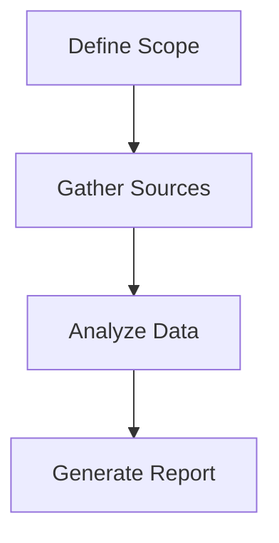
```

**Advantages:**
- Live preview in VS Code with extension
- Easy to edit and update
- Version control friendly
- No separate image files to manage
- Automatic rendering on GitHub/GitLab

**When to use:**
- During research and analysis phase
- In markdown files viewed in VS Code or GitHub
- For collaborative documents
- When diagrams change frequently

#### Option 2: Render to Image (Required for Final Deliverables)

```bash
# Render diagram
mmdc -i workflow.mmd -o images/workflow.png

# Reference in markdown

```

**Advantages:**
- Works in any document format (Word, PDF, PowerPoint)
- Consistent rendering across all platforms
- No plugin dependencies
- Professional appearance in final reports

**When to use:**
- Generating final reports with Pandoc
- Creating presentations
- Exporting to Word/PDF
- Sharing with non-technical stakeholders
- Publishing to platforms without Mermaid support

#### Recommended Workflow

```bash
# 1. During Research: Use Mermaid code in markdown
# Edit in VS Code with live preview
vim research/project/analysis.md

# 2. Before Final Report: Render to images
mmdc -i diagrams/workflow.mmd -o images/workflow.png
mmdc -i diagrams/architecture.mmd -o images/architecture.png

# 3. Generate Report: Pandoc uses the images
pandoc research/project/report.md -o output/report.docx
```

**Pro Tip:** Keep both! Store `.mmd` source files in `diagrams/` and rendered images in `images/`. This way you can:
- Edit diagrams easily (from `.mmd` files)
- Use in final reports (from `.png` files)
- Track changes in version control (`.mmd` files show diffs)

## Best Practices

### 1. Keep Diagrams Simple

❌ **Too Complex:**
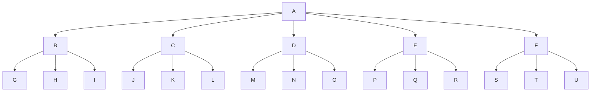

✅ **Better:**
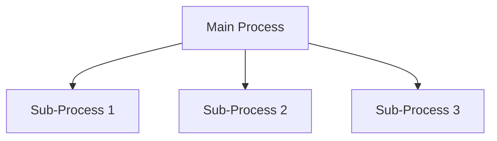

### 2. Use Descriptive Labels

❌ **Unclear:**
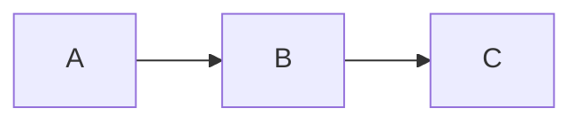

✅ **Clear:**
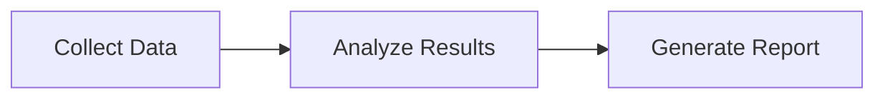

### 3. Choose the Right Diagram Type

- **Process/Workflow**: Flowchart
- **Interactions**: Sequence Diagram
- **Timeline**: Gantt Chart or Timeline
- **Structure**: Class Diagram or ER Diagram
- **Concepts**: Mind Map

### 4. Use Consistent Styling

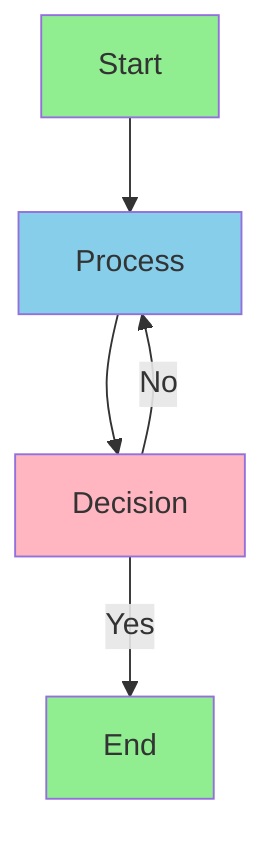

### 5. Version Control Diagrams

Store diagram source files separately:

```
research/project/
├── diagrams/
│   ├── workflow.mmd
│   ├── architecture.mmd
│   └── timeline.mmd
├── images/
│   ├── workflow.png
│   ├── architecture.png
│   └── timeline.png
└── report.md
```

## Integration with Research Workflow

### 1. Planning Phase

Use mind maps and flowcharts:

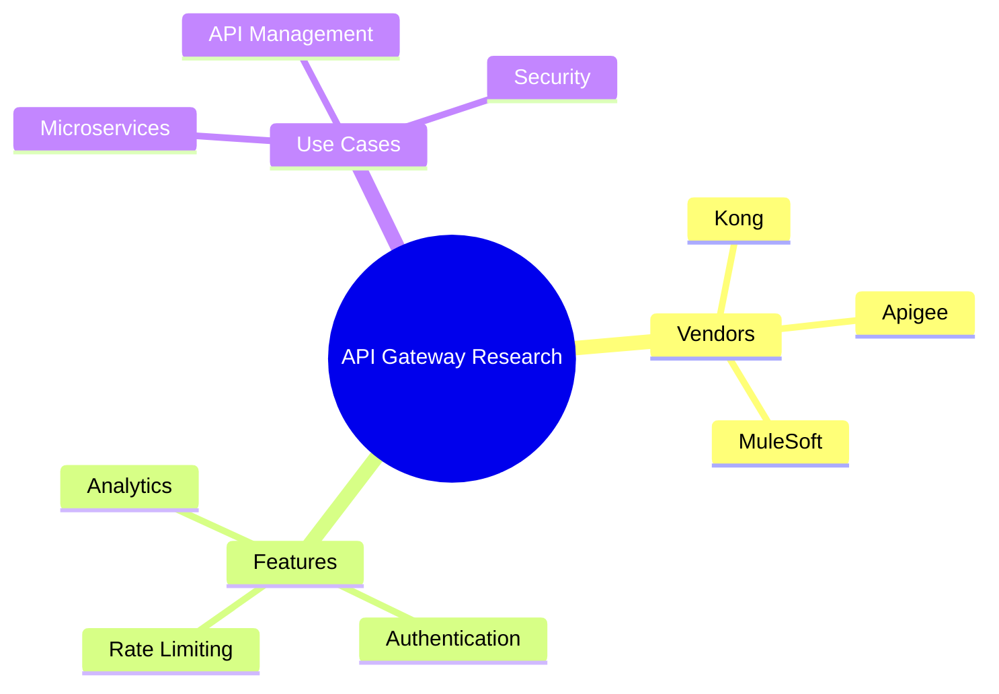

### 2. Execution Phase

Use sequence diagrams and flowcharts:

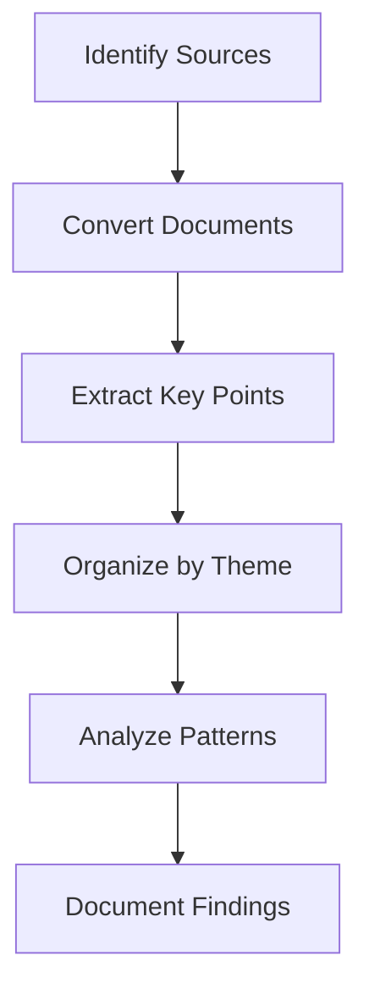

### 3. Reporting Phase

Use Gantt charts and timelines:

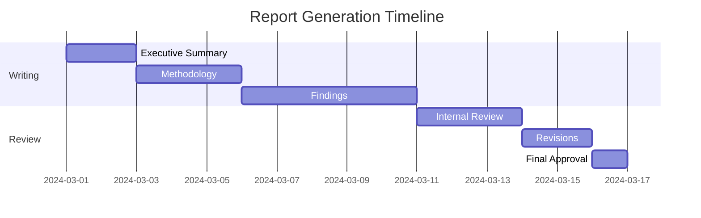

## Common Use Cases

### Competitive Analysis

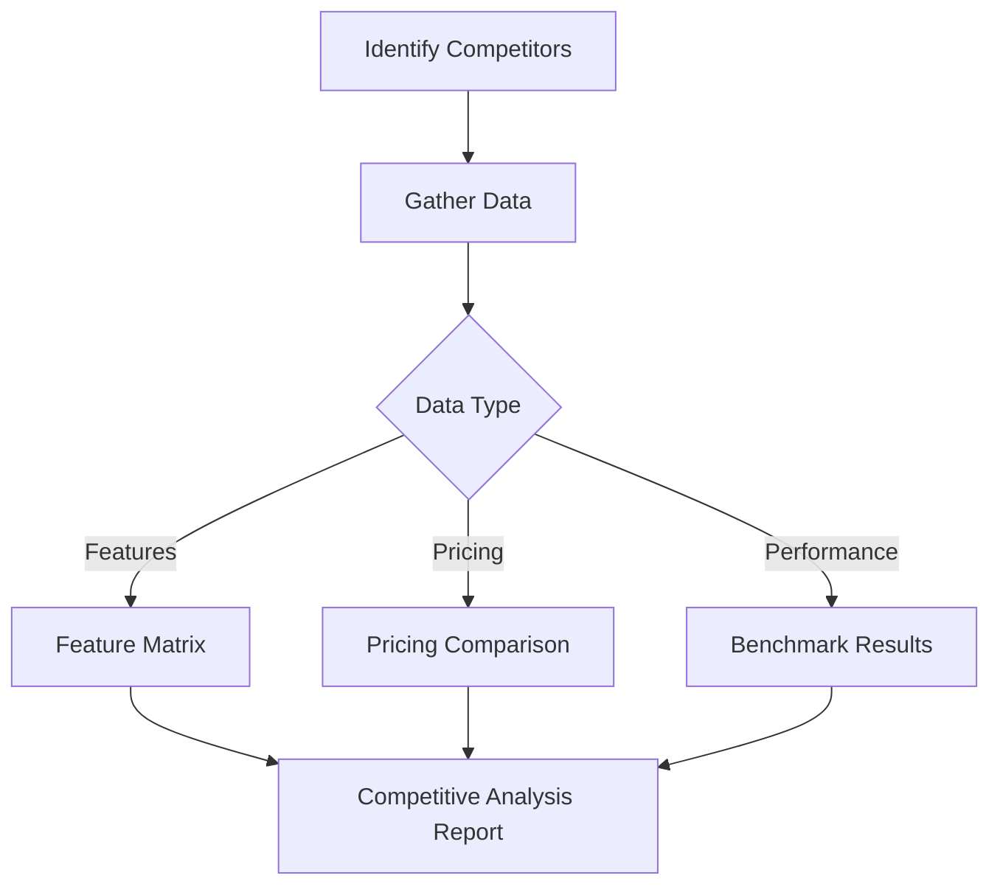

### Research Methodology

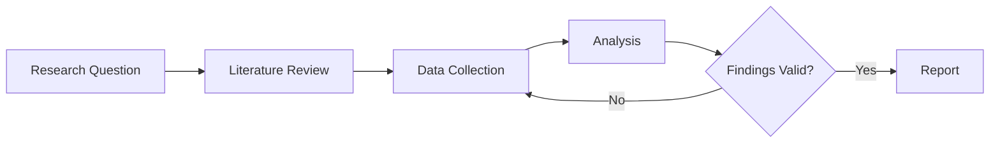

### System Architecture

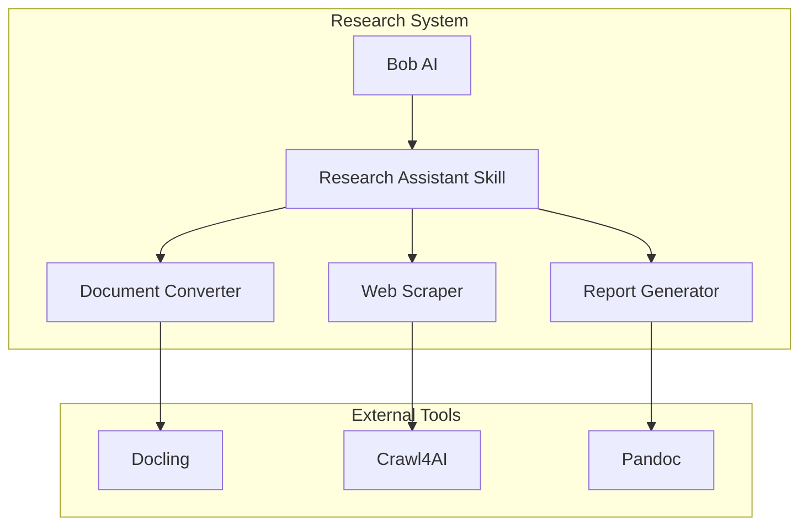

## Troubleshooting

### Diagram Not Rendering

**Issue**: Diagram doesn't appear in preview

**Solutions**:
1. Check Mermaid syntax
2. Verify VS Code extension is installed
3. Ensure code block uses `mermaid` language identifier

### Syntax Errors

**Issue**: Diagram shows error message

**Solutions**:
1. Validate syntax at [Mermaid Live Editor](https://mermaid.live/)
2. Check for missing arrows or brackets
3. Verify node IDs are unique

### Export Issues

**Issue**: mmdc command fails

**Solutions**:
```bash
# Reinstall mermaid-cli
npm install -g @mermaid-js/mermaid-cli

# Check for puppeteer issues
npm install -g puppeteer

# Use specific output format
mmdc -i input.mmd -o output.svg  # Try SVG instead of PNG
```

## Resources

### Official Documentation
- [Mermaid Documentation](https://mermaid.js.org/)
- [Mermaid Live Editor](https://mermaid.live/)
- [Mermaid CLI](https://github.com/mermaid-js/mermaid-cli)

### VS Code Extensions
- [Mermaid Preview](https://marketplace.visualstudio.com/items?itemName=bierner.markdown-mermaid)
- [Markdown Preview Mermaid Support](https://marketplace.visualstudio.com/items?itemName=bierner.markdown-mermaid)

### Examples and Templates
- See `examples/` directory for diagram templates
- Check research reports for real-world usage

## Quick Reference

### Flowchart Syntax
```
flowchart TD    # Top to Down
flowchart LR    # Left to Right
A[Rectangle]    # Node with text
A --> B         # Arrow
A -.-> B        # Dotted arrow
A ==> B         # Thick arrow
```

### Sequence Diagram Syntax
```
participant A
participant B
A->>B: Message
B-->>A: Response
```

### Gantt Chart Syntax
```
gantt
    title Project
    dateFormat YYYY-MM-DD
    section Phase
    Task :2024-01-01, 7d
```

---

**Pro Tip**: Use the Mermaid Live Editor to prototype diagrams, then copy the code into your research documents!

**Last Updated**: 2026-06-17