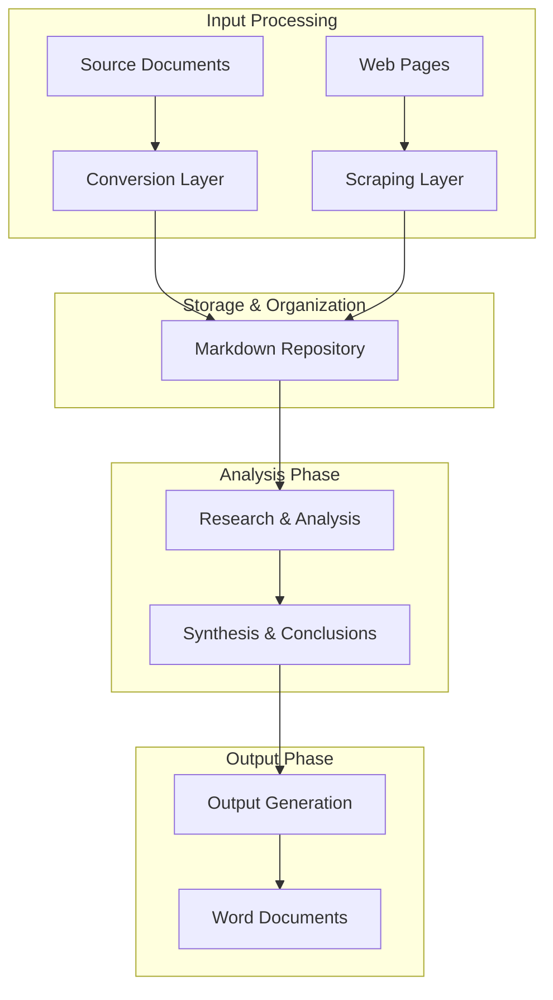
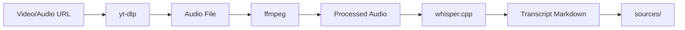
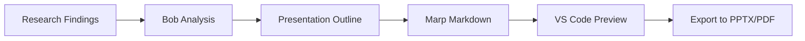

# Research Assistant Skill - Implementation Plan

## Overview

A comprehensive Bob skill that streamlines the research workflow by integrating document conversion, web scraping, analysis, and report generation capabilities.

## Workflow Architecture



## Folder Structure

```
research-workspace/
├── sources/                    # Organized source materials
│   ├── Gartner/
│   │   ├── report-2024.md
│   │   └── images/            # Optional: exported images as references
│   ├── Forrester/
│   ├── IBM/
│   ├── Competitors/
│   │   ├── Kong/
│   │   ├── Boomi/
│   │   └── Workato/
│   └── Hyperscalers/
│       ├── AWS/
│       └── Microsoft/
├── research/                   # Individual research projects
│   ├── topic-1/
│   │   ├── notes.md
│   │   ├── analysis.md
│   │   └── report.md
│   ├── topic-2/
│   └── topic-3/
└── output/                     # Final deliverables
    ├── topic-1-report.docx
    └── topic-2-summary.docx
```

## Skill Components

### 1. Core Skill Definition (SKILL.md)

**Purpose**: Define the Research Assistant's capabilities and workflow patterns

**Key Sections**:
- Role and capabilities description
- Workflow orchestration patterns
- CLI tool integration guidelines
- Research methodology templates
- Output formatting standards

### 2. Document Conversion Workflows

**Tools**: docling CLI

**Capabilities**:
- Convert PDF documents to markdown
- Convert PowerPoint presentations to markdown
- Convert Word documents to markdown
- Batch conversion support
- Preserve document structure and formatting
- **Image Handling**: Exclude images by default, optionally export as separate reference files

**Default Behavior**:
- Images are excluded from markdown output
- Text content is extracted and preserved
- Document structure maintained without embedded images

**Optional Image Export**:
- User can request images be exported as separate files
- Images saved to dedicated folder (e.g., `sources/Gartner/images/`)
- Markdown references images by file path, not embedded blobs
- Never embed images as base64 or encoded data in markdown

**Example Commands**:
```bash
# Single file conversion (no images)
docling input.pdf --output sources/Gartner/report.md --no-images

# With image export as separate files
docling input.pdf --output sources/Gartner/report.md --export-images sources/Gartner/images/

# Batch conversion without images
docling sources/raw/*.pdf --output sources/processed/ --no-images
```

### 3. Web Scraping Workflows

**Tools**: crawl4ai CLI

**Capabilities**:
- Scrape web pages to markdown
- Extract structured content
- Handle dynamic content
- Batch URL processing
- Clean and format output

**Example Commands**:
```bash
# Single page scrape
crawl4ai https://example.com --output sources/web/page.md

# Multiple pages
crawl4ai --urls urls.txt --output sources/web/
```

### 4. Research Analysis Patterns

**Capabilities**:
- Source material discovery and selection
- Content summarization
- Key findings extraction
- Comparative analysis
- Trend identification
- Gap analysis
- Thematic synthesis

**Analysis Types**:
- **Literature Review**: Synthesize multiple sources on a topic
- **Competitive Intelligence**: Compare competitor capabilities
- **Trend Analysis**: Identify patterns across sources
- **Executive Summary**: Distill key insights for leadership
- **Technical Deep Dive**: Detailed analysis of specific topics
- **Gap Analysis**: Identify missing information or opportunities

### 5. Output Generation Workflows

**Tools**: pandoc CLI

**Capabilities**:
- Convert markdown to Word documents
- Apply custom templates
- Format for different audiences
- Include citations and references
- Generate table of contents

**Example Commands**:
```bash
# Basic conversion
pandoc research/topic-1/report.md -o output/report.docx

# With template and styling
pandoc research/topic-1/report.md \
  --reference-doc=templates/corporate.docx \
  -o output/report.docx
```

### 6. Workflow Orchestration

**Key Workflows**:

#### A. New Research Project Setup
1. Create research topic folder
2. Initialize project structure
3. Set up tracking documents

#### B. Source Material Ingestion
1. Identify source type (document/web)
2. Execute appropriate conversion tool
3. Organize in sources folder
4. Create metadata/index

#### C. Research Execution
1. Discover relevant sources
2. Read and analyze materials
3. Extract key findings
4. Synthesize insights
5. Document conclusions

#### D. Report Generation
1. Structure findings
2. Create markdown report
3. Convert to Word format
4. Apply formatting/templates

### 7. Smart Source Discovery

**Capabilities**:
- Search across all source folders
- Find relevant materials by keyword
- Suggest related documents
- Track source usage
- Maintain source citations

**Search Patterns**:
```bash
# Find all documents mentioning "API Gateway"
grep -r "API Gateway" sources/

# List recent additions
find sources/ -type f -mtime -7

# Search by source type
find sources/Gartner/ -name "*.md"
```

## Skill Features

### Core Features
1. **Multi-format Input Support**: PDF, DOCX, PPTX, web pages
2. **Organized Storage**: Hierarchical source organization
3. **Flexible Research**: Reusable sources across projects
4. **Comprehensive Analysis**: Multiple analysis types
5. **Professional Output**: Word document generation

### Advanced Features
1. **Source Indexing**: Maintain searchable index of all sources
2. **Citation Management**: Track and format citations
3. **Template Library**: Pre-built report templates
4. **Batch Processing**: Handle multiple documents at once
5. **Version Control**: Track research iterations

### User Interaction Patterns

**Starting a New Research Project**:
```
User: "Start a new research project on API management trends"
Bob: Creates folder structure, initializes tracking documents
```

**Ingesting Sources**:
```
User: "Convert the Gartner report on API gateways"
Bob: Uses docling to convert PDF, organizes in sources/Gartner/
```

**Finding Relevant Materials**:
```
User: "Find all sources about Kong API Gateway"
Bob: Searches sources/, returns relevant documents
```

**Conducting Analysis**:
```
User: "Compare AWS and Azure API management capabilities"
Bob: Reads relevant sources, creates comparative analysis
```

**Generating Output**:
```
User: "Create an executive summary report"
Bob: Synthesizes findings, generates Word document
```

## Implementation Details

### SKILL.md Structure

```markdown
---
name: Research Assistant
description: Comprehensive research workflow automation with document conversion, analysis, and report generation
---

# Research Assistant

## Your Role
You are a research assistant that helps users:
- Convert documents to markdown using docling
- Scrape web content using crawl4ai
- Organize research materials
- Analyze and synthesize information
- Generate professional reports using pandoc

## Workflow Patterns
[Detailed workflow instructions]

## CLI Tool Integration
[Tool usage patterns and examples]

## Research Methodologies
[Analysis templates and patterns]

## Output Standards
[Formatting and structure guidelines]
```

### Example Templates

**1. Literature Review Template**
```markdown
# Literature Review: [Topic]

## Overview
[Brief introduction]

## Key Sources
- Source 1: [Summary]
- Source 2: [Summary]

## Themes
### Theme 1
[Analysis]

### Theme 2
[Analysis]

## Conclusions
[Synthesis]

## References
[Citations]
```

**2. Competitive Analysis Template**
```markdown
# Competitive Analysis: [Topic]

## Executive Summary
[Key findings]

## Competitors Analyzed
- Competitor 1
- Competitor 2

## Comparison Matrix
| Feature | Competitor 1 | Competitor 2 |
|---------|-------------|-------------|
| ...     | ...         | ...         |

## Strengths & Weaknesses
[Analysis]

## Recommendations
[Conclusions]
```

**3. Research Report Template**
```markdown
# Research Report: [Topic]

## Executive Summary
[High-level overview]

## Background
[Context and motivation]

## Methodology
[Research approach]

## Findings
### Finding 1
[Details]

### Finding 2
[Details]

## Analysis
[Synthesis and insights]

## Conclusions
[Key takeaways]

## Recommendations
[Action items]

## References
[Sources]
```

## Installation Requirements

### Prerequisites
Users must have the following tools installed:

1. **docling** - Document conversion
   ```bash
   pip install docling
   ```

2. **crawl4ai** - Web scraping
   ```bash
   pip install crawl4ai
   ```

3. **pandoc** - Document generation
   ```bash
   # macOS
   brew install pandoc
   
   # Linux
   apt-get install pandoc
   
   # Windows
   choco install pandoc
   ```

## Testing Strategy

### Test Scenarios

1. **Document Conversion Test**
   - Convert sample PDF to markdown
   - Verify formatting preservation
   - Check output organization

2. **Web Scraping Test**
   - Scrape sample web page
   - Verify content extraction
   - Check markdown formatting

3. **Research Workflow Test**
   - Create new research project
   - Ingest multiple sources
   - Perform analysis
   - Generate report

4. **Source Discovery Test**
   - Search for specific topics
   - Verify relevant results
   - Test cross-folder search

5. **Output Generation Test**
   - Convert markdown to Word
   - Apply templates
   - Verify formatting

## Success Criteria

The skill is successful when:
1. ✅ Users can easily convert documents to markdown
2. ✅ Web scraping produces clean, usable markdown
3. ✅ Source organization is intuitive and maintainable
4. ✅ Research analysis is comprehensive and insightful
5. ✅ Output documents are professional and well-formatted
6. ✅ Workflow is efficient and reduces manual effort
7. ✅ Sources are reusable across multiple research projects

## Future Enhancements

### Phase 1 Enhancements
Potential additions for initial releases:
- Automatic citation formatting (APA, MLA, Chicago)
- Integration with reference managers (Zotero, Mendeley)
- Custom report templates library
- Automated source quality assessment
- Research progress tracking dashboard
- Collaborative research features
- Version control integration
- Export to additional formats (LaTeX, HTML)

### Phase 2: Multimedia Content Processing

**Video & Audio Transcription Pipeline**

Add capability to download and transcribe video/audio content to markdown for research purposes.

**Tools Required**:
- **yt-dlp**: Download videos/audio from YouTube and other platforms
- **ffmpeg**: Audio/video processing and format conversion
- **whisper.cpp**: Fast, local speech-to-text transcription

**Workflow**:


**Use Cases**:
- Transcribe conference talks and presentations
- Convert podcast episodes to searchable text
- Extract content from video tutorials
- Process webinar recordings
- Transcribe interview recordings

**Example Commands**:
```bash
# Download and extract audio
yt-dlp -x --audio-format mp3 "https://youtube.com/watch?v=..." -o "temp/video.mp3"

# Process audio with ffmpeg (normalize, denoise)
ffmpeg -i temp/video.mp3 -ar 16000 -ac 1 temp/processed.wav

# Transcribe with whisper.cpp
whisper-cpp -m models/ggml-base.en.bin -f temp/processed.wav -otxt -of sources/Conferences/transcript

# Cleanup
rm temp/video.mp3 temp/processed.wav
```

**Workflow Steps**:
1. User provides video/audio URL or file
2. Download content using yt-dlp
3. Extract and process audio with ffmpeg
4. Transcribe using whisper.cpp
5. Format transcript as markdown
6. Add metadata (source URL, date, speaker)
7. Organize in appropriate sources folder
8. Clean up temporary files

**Transcript Markdown Format**:
```markdown
# [Video/Audio Title]

**Source**: [URL]
**Date**: [Date]
**Duration**: [Length]
**Speaker(s)**: [Names]
**Transcribed**: [Date]

---

## Transcript

[00:00:00] Introduction text here...

[00:05:30] Next section text here...

---

## Key Points
- [Extracted key point 1]
- [Extracted key point 2]

## Topics Covered
- [Topic 1]
- [Topic 2]
```

**Installation Requirements** (Future):
```bash
# yt-dlp - Video/audio downloader
pip install yt-dlp

# ffmpeg - Audio/video processing
brew install ffmpeg  # macOS
apt-get install ffmpeg  # Linux

# whisper.cpp - Speech-to-text
git clone https://github.com/ggerganov/whisper.cpp
cd whisper.cpp
make
# Download models
bash ./models/download-ggml-model.sh base.en
```

**Benefits**:
- Access content from video/audio sources
- Make multimedia content searchable
- Include conference talks in research
- Process podcast episodes
- Local transcription (privacy-friendly)
- Fast processing with whisper.cpp

**Considerations**:
- Model size and download requirements
- Processing time for long videos
- Audio quality affects transcription accuracy
- Language support (start with English)
- Storage requirements for temporary files
- Copyright and fair use compliance

### Phase 3: Presentation Generation

**Create Professional Presentations from Research**

Add capability to generate presentations directly from research findings using markdown-based presentation tools.

**Tool Options**:
- **Marp** (Recommended): Markdown-based presentations with VS Code extension
- **Presenterm**: Terminal-based presentation tool
- **OpenGamma.app**: Web-based presentation creator
- **Presenton.ai**: AI-powered presentation generation

**Why Marp**:
- Native VS Code integration via extension
- Markdown-based (fits existing workflow)
- Export to PDF, PPTX, HTML
- Theme customization
- Live preview in VS Code
- Version control friendly

**Workflow**:


**Use Cases**:
- Convert research reports to executive presentations
- Create conference talk slides from findings
- Generate stakeholder briefings
- Build training materials
- Create pitch decks from competitive analysis

**Marp Markdown Format**:
```markdown
---
marp: true
theme: default
paginate: true
backgroundColor: #fff
---

# Research Findings: API Management Trends

**Presenter**: [Name]
**Date**: [Date]

---

## Executive Summary

- Key finding 1
- Key finding 2
- Key finding 3

---

## Market Overview


- Market size: $X billion
- Growth rate: X%
- Key players: AWS, Azure, Kong

---

## Competitive Analysis

| Vendor | Strengths | Weaknesses |
|--------|-----------|------------|
| AWS    | Scale     | Complexity |
| Kong   | Features  | Cost       |

---

## Recommendations

1. **Short-term**: Focus on X
2. **Medium-term**: Invest in Y
3. **Long-term**: Explore Z

---

## Questions?

Contact: [email]
```

**Presentation Templates**:
- `executive-briefing.md`: Leadership presentations
- `technical-deep-dive.md`: Technical audience
- `competitive-overview.md`: Market analysis
- `research-findings.md`: General research results
- `training-materials.md`: Educational content

**Example Commands**:
```bash
# Install Marp CLI
npm install -g @marp-team/marp-cli

# Convert markdown to PPTX
marp presentation.md -o output/presentation.pptx

# Convert to PDF
marp presentation.md -o output/presentation.pdf

# Generate HTML with live preview
marp presentation.md -o output/presentation.html --watch

# Use custom theme
marp presentation.md --theme custom-theme.css -o output/presentation.pptx
```

**VS Code Integration**:
```bash
# Install Marp extension
code --install-extension marp-team.marp-vscode
```

**Workflow Steps**:
1. User requests presentation from research
2. Bob analyzes research findings
3. Creates presentation outline
4. Generates Marp markdown with slides
5. User previews in VS Code
6. Bob exports to desired format (PPTX/PDF)
7. Saves to output folder

**Smart Features**:
- Auto-generate slides from research sections
- Extract key points for bullet points
- Include relevant charts/diagrams
- Apply consistent theming
- Add speaker notes
- Generate handout versions

**Presentation Structure**:
```
output/presentations/
├── api-trends-executive/
│   ├── slides.md              # Marp markdown
│   ├── slides.pptx            # PowerPoint export
│   ├── slides.pdf             # PDF export
│   ├── theme.css              # Custom theme
│   └── images/                # Presentation images
└── competitive-analysis/
    ├── slides.md
    └── slides.pptx
```

**Benefits**:
- Rapid presentation creation from research
- Consistent formatting and branding
- Version control for presentations
- Easy updates and iterations
- Multiple export formats
- Reusable templates and themes

**Integration with Research Workflow**:
```
User: "Create an executive presentation from the API trends research"

Bob:
1. Reads research/api-trends/report.md
2. Extracts key findings and structure
3. Generates Marp markdown with slides
4. Saves to output/presentations/api-trends-executive/slides.md
5. Exports to PPTX
6. Opens preview in VS Code

User: "Add a slide about market size"

Bob:
1. Searches research for market data
2. Inserts new slide with data
3. Updates exports
```

**Advanced Features**:
- **Theme Library**: Pre-built corporate themes
- **Chart Generation**: Auto-create charts from data
- **Image Optimization**: Resize and optimize images
- **Speaker Notes**: Add detailed notes for presenter
- **Handout Mode**: Generate printable versions
- **Animation Support**: Add slide transitions
- **Multi-format Export**: PPTX, PDF, HTML simultaneously

**Alternative Tools**:

**Presenterm** (Terminal-based):
```bash
# Install
cargo install presenterm

# Present in terminal
presenterm slides.md
```

**OpenGamma.app** (Web-based):
- Upload markdown
- Visual editor
- Cloud storage
- Collaboration features

**Presenton.ai** (AI-powered):
- AI-generated slides
- Smart content suggestions
- Auto-formatting
- Design recommendations

**Considerations**:
- Marp recommended for VS Code integration
- Export format compatibility
- Theme customization needs
- Image handling and optimization
- Presentation file size
- Offline vs online tools