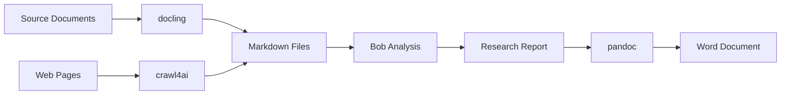

# Research Assistant Skill - Project Summary

## Overview

This project will create a Bob skill that streamlines your research workflow by integrating three powerful CLI tools:
- **docling**: Document conversion (PDF, DOCX, PPTX → Markdown)
- **crawl4ai**: Web scraping (URLs → Markdown)
- **pandoc**: Report generation (Markdown → Word)

## Key Features

### 1. Intelligent Document Processing
- Convert various document formats to clean markdown
- **Images excluded by default** to keep markdown lightweight
- Optional image export as separate reference files (never embedded as blobs)
- Batch processing support for multiple documents

### 2. Organized Source Management
```
sources/
├── Gartner/
├── Forrester/
├── IBM/
├── Competitors/
│   ├── Kong/
│   ├── Boomi/
│   └── Workato/
└── Hyperscalers/
    ├── AWS/
    └── Microsoft/
```

### 3. Flexible Research Workflow
- Create research projects with structured folders
- Discover and reuse sources across multiple projects
- Smart source search and discovery
- Multiple analysis types (literature review, competitive analysis, trend analysis, etc.)

### 4. Professional Output Generation
- Convert research findings to Word documents
- Apply custom templates and formatting
- Generate various report types (executive summaries, technical deep dives, etc.)
- Include citations and references

## Workflow Example



## Typical User Journey

1. **Ingest Sources**
   ```
   User: "Convert the Gartner API Management report to markdown"
   Bob: Executes docling, organizes in sources/Gartner/
   ```

2. **Start Research**
   ```
   User: "Start research on API management trends"
   Bob: Creates research/api-management-trends/ folder structure
   ```

3. **Find Materials**
   ```
   User: "Find all sources about API gateways"
   Bob: Searches sources/, returns relevant documents
   ```

4. **Analyze**
   ```
   User: "Compare AWS and Azure API management"
   Bob: Reads sources, creates comparative analysis
   ```

5. **Generate Report**
   ```
   User: "Create an executive summary"
   Bob: Synthesizes findings, generates Word document
   ```

## Implementation Structure

```
.bob/skills/research-assistant/
├── SKILL.md                    # Main skill definition
├── README.md                   # User documentation
├── examples/                   # Example workflows
│   ├── document-conversion/
│   ├── web-scraping/
│   ├── research-analysis/
│   └── report-generation/
├── templates/                  # Report templates
│   ├── literature-review.md
│   ├── competitive-analysis.md
│   ├── executive-summary.md
│   └── research-report.md
└── guides/                     # Detailed guides
    ├── cli-tools.md
    ├── workflows.md
    └── best-practices.md
```

## Key Design Decisions

### Image Handling (docling)
- **Default**: Images excluded from markdown output
- **Rationale**: Keeps markdown files lightweight and text-focused
- **Option**: Export images as separate reference files when needed
- **Never**: Embed images as base64 or encoded blobs in markdown

### Source Organization
- **Hierarchical structure** by source type (Gartner, Forrester, etc.)
- **Reusable across projects** - sources stored centrally
- **Easy discovery** - search across all sources
- **Metadata tracking** - maintain source indexes

### Research Projects
- **Isolated folders** for each research topic
- **Structured files** (notes.md, analysis.md, report.md)
- **Version control friendly** - all text-based files
- **Flexible workflow** - adapt to different research needs

## Prerequisites

Users must install these tools before using the skill:

```bash
# docling - Document conversion
pip install docling

# crawl4ai - Web scraping
pip install crawl4ai

# pandoc - Document generation
brew install pandoc  # macOS
```

## Benefits

1. **Efficiency**: Automate repetitive conversion and formatting tasks
2. **Organization**: Maintain consistent, searchable source library
3. **Reusability**: Use sources across multiple research projects
4. **Quality**: Professional output with consistent formatting
5. **Flexibility**: Adapt workflow to different research needs
6. **Integration**: Seamless workflow from input to output

## Next Steps

1. **Review this plan** - Confirm it meets your requirements
2. **Provide feedback** - Any changes or additions needed?
3. **Implementation** - Switch to Code mode to build the skill
4. **Testing** - Validate with real research workflow
5. **Refinement** - Iterate based on usage experience

## Documentation Deliverables

- ✅ **PLAN.md**: High-level architecture and design
- ✅ **IMPLEMENTATION_ROADMAP.md**: Detailed implementation guide
- ✅ **SUMMARY.md**: Executive overview (this document)

## Future Enhancements

### Phase 2: Multimedia Transcription

**Video and audio transcription capabilities**

**Tools**:
- **yt-dlp**: Download videos/audio from YouTube and other platforms
- **ffmpeg**: Audio processing and format conversion
- **whisper.cpp**: Fast, local speech-to-text transcription

**Workflow**:
```
Video/Audio URL → yt-dlp → Audio File → ffmpeg → Processed Audio → whisper.cpp → Transcript Markdown
```

**Use Cases**:
- Transcribe conference talks and presentations
- Convert podcast episodes to searchable text
- Extract content from video tutorials
- Process webinar recordings
- Transcribe interview recordings

**Benefits**:
- Access multimedia content for research
- Make video/audio content searchable
- Include conference talks in analysis
- Local transcription (privacy-friendly)
- Fast processing with whisper.cpp

**Example**:
```
User: "Transcribe the AWS re:Invent keynote"
Bob: Downloads video, extracts audio, transcribes, saves to sources/Hyperscalers/AWS/keynote-transcript.md
```

### Phase 3: Presentation Generation

**Create professional presentations from research findings**

**Tools**:
- **Marp** (Recommended): Markdown presentations with VS Code extension
- **Presenterm**: Terminal-based presentations
- **OpenGamma.app**: Web-based presentation creator
- **Presenton.ai**: AI-powered presentation generation

**Why Marp**:
- Native VS Code integration
- Markdown-based (seamless workflow)
- Export to PPTX, PDF, HTML
- Live preview
- Theme customization
- Version control friendly

**Workflow**:
```
Research Findings → Bob Analysis → Presentation Outline → Marp Markdown → VS Code Preview → Export to PPTX/PDF
```

**Use Cases**:
- Convert research reports to executive presentations
- Create conference talk slides
- Generate stakeholder briefings
- Build training materials
- Create pitch decks from competitive analysis

**Benefits**:
- Rapid presentation creation from research
- Consistent formatting and branding
- Version control for presentations
- Easy updates and iterations
- Multiple export formats
- Reusable templates and themes

**Example**:
```
User: "Create an executive presentation from the API trends research"
Bob: Analyzes report, generates Marp slides, exports to PPTX, opens preview in VS Code
```

**Presentation Templates**:
- Executive briefing
- Technical deep dive
- Competitive analysis
- Research findings
- Training materials

See [`PLAN.md`](PLAN.md) and [`IMPLEMENTATION_ROADMAP.md`](IMPLEMENTATION_ROADMAP.md) for detailed specifications.

## Questions for You

Before proceeding to implementation:

1. Does this approach align with your research workflow?
2. Are there any missing features or capabilities?
3. Should we prioritize certain features for the initial release?
4. Should multimedia transcription (Phase 2) and presentation generation (Phase 3) be included in initial release or added later?
5. Any specific report templates, analysis types, or presentation themes you need?
6. Ready to proceed with implementation?